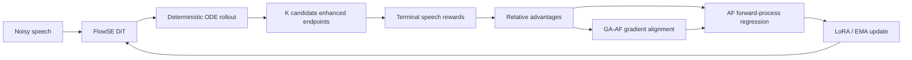

# GA-AF-FlowSE

## Forward-Process Reinforcement Learning for Flow-Matching Speech Enhancement

[](https://github.com/spzhang7/GA-AF-FlowSE/actions/workflows/quality.yml)
[](https://www.python.org/)

This repository is the reference implementation of **Gradient-Aligned
AdvantageFlow (GA-AF)** for FlowSE-based speech enhancement. In the code,
the method uses the `gaaf` package and configuration namespace.

The method performs reward-guided post-training entirely through
forward-process regression. It keeps FlowSE's deterministic ODE inference
formulation, and combines reward-specific advantages according to their
induced gradient alignment instead of using fixed reward weights.

> Paper: *Forward-Process Reinforcement Learning for Flow-Matching Speech
> Enhancement*. The paper reports the DNS2020 results and training-time
> comparisons reproduced by the configurations in this repository.

## Highlights

- Deterministic FlowSE ODE rollouts during post-training and inference.
- Ordinary AdvantageFlow (AF) and Gradient-Aligned AdvantageFlow (GA-AF).
- A controlled FlowSE-GRPO implementation for the paper comparison.
- Composite reward from DNSMOS OVRL, ERes2Net speaker similarity, and
  SpeechBERTScore content fidelity.
- Public smoke configurations, full 5000-update templates, dataset preparation
  tools, evaluation utilities, and unit tests.
- A pinned FlowSE baseline with its upstream commit and local compatibility
  patch documented separately.

## Method overview



For each noisy condition, the rollout generates K=8 candidates. AF uses
relative candidate advantages for forward-process regression. GA-AF computes
reward-specific induced gradients and dynamically emphasizes auxiliary
objectives whose directions align with the primary perceptual-quality
objective.

## Paper results

The following values are from the accompanying paper's DNS2020 evaluation.
GRPO dagger denotes the controlled re-implementation used in the comparison.

| Method | No Reverb OVRL | With Reverb OVRL |
|---|---:|---:|
| FlowSE Base | 3.353 | 3.225 |
| FlowSE Base + GRPO | 3.412 | 3.385 |
| FlowSE Base + AF | 3.504 | 3.472 |
| FlowSE Base + GA-AF | **3.616** | **3.614** |

Under the matched 5000-update comparison reported in the paper, measured on
four NVIDIA A800 GPUs, post-training time was 126.9 hours for AF, 139.6 hours
for GA-AF, and 271.1 hours for GRPO. GA-AF therefore used 48.5% less
post-training time than the controlled GRPO implementation.

GA-AF is quality-primary by design. The paper also reports a trade-off between
DNSMOS improvement and speaker/content fidelity; users should evaluate all
reported metrics rather than relying on OVRL alone.

## Repository layout

```text
GA-AF-FlowSE/
├── flowse/                 # Third-party FlowSE baseline
├── rl/
│   ├── af/                 # Ordinary AdvantageFlow
│   ├── gaaf/               # GA-AF gradient-alignment extension
│   ├── grpo/               # Controlled GRPO comparison
│   ├── common/             # Shared data, FlowSE, LoRA, and protocol modules
│   └── rewards/            # Composite rewards and calibration utilities
├── configs/                # FlowSE, AF, GA-AF, and GRPO templates
├── scripts/                # Training and FlowSE maintenance entry points
├── tools/                  # Dataset preparation and evaluation tools
├── pretrainmodel/          # Pretrained evaluator download instructions
├── checkpoints/            # Checkpoint placement and release instructions
└── docs/                   # Upstream and compatibility notes
```

## Installation

Use Python 3.10 or newer. The single requirements.txt contains runtime,
evaluation, test, and lint dependencies:

```bash
python -m pip install -r requirements.txt
```

For CUDA 12.1, install the matching PyTorch wheels first when your platform
does not select them automatically:

```bash
python -m pip install torch==2.2.0+cu121 torchaudio==2.2.0+cu121 \
  --index-url https://download.pytorch.org/whl/cu121
python -m pip install -r requirements.txt
```

CPU-only users can install the ordinary torch==2.2.0 and
torchaudio==2.2.0 entries from the requirements file.

Run the method-side tests with:

```bash
python -m pytest -q rl/af/tests rl/grpo/tests
```

The complete fresh-checkout workflow, including model placement, data layout,
smoke tests, and full AF/GA-AF/GRPO commands, is in
[docs/GETTING_STARTED.md](docs/GETTING_STARTED.md).

## Data and pretrained models

The repository does not redistribute speech datasets, evaluator weights,
FlowSE checkpoints, Vocos weights, or training artifacts.

1. Prepare LibriTTS/DNS10s paired data and manifests with the tools described
   in the configuration templates.
2. Download FlowSE/SFT and Vocos weights according to
   checkpoints/README.md.
3. Download DNSMOS, ERes2Net, and WavLM/SpeechBERTScore models according to
   pretrainmodel/README.md.
4. Edit the data, model, and output paths in a public YAML template.

The public composite reward uses the DNS10s 8192-condition calibration:

```text
DNSMOS OVRL:       0.6 * (DNSMOS_OVRL / 4) / 0.07032371343108539
ERes2Net speaker:      1.0 * ERes2Net / 0.13865593039460408
SpeechBERTScore:       1.0 * SpeechBERTScore / 0.09550272361009968

source_nfe=10, std_ddof=0, dnsmos_divisor=4.0
```

## Checkpoints

Binary checkpoints are distributed separately from the source repository. The
SFT-20k, AF, GA-AF, and GRPO project checkpoints will be attached to the
GitHub [Releases page](https://github.com/spzhang7/GA-AF-FlowSE/releases).
The original FlowSE checkpoint is larger than GitHub's per-asset limit and is
downloaded from the upstream Hugging Face release as described in
checkpoints/README.md.

| Release asset | Purpose |
|---|---|
| flowse_wenetspeech4tts_premium_best.pt.tar | Original FlowSE baseline; upstream Hugging Face |
| flowse_sft20k_step020000.pt | 20k-step supervised FlowSE base |
| af_libritts_dns10s_step005000.pt | Ordinary AF checkpoint |
| gaaf_libritts_dns10s_0_to_5000_step005000.pt | GA-AF checkpoint |
| grpo_voicebank_controlled_latest.pt | Controlled GRPO checkpoint |

The release assets are intentionally not committed to Git because of their
size and the separate terms that apply to model weights. See
checkpoints/README.md for the expected local paths.

## Training

Smoke configurations validate the public code path with a small budget:

```bash
python scripts/train_af.py --config configs/af/af_smoke.yaml
python scripts/train_af.py --config configs/af/gaaf_smoke.yaml
python scripts/train_grpo.py \
  --config configs/grpo/grpo_libritts_dns10s_4gpu_production_geometry_smoke.yaml
```

For the paper-scale AF and GA-AF runs:

```bash
python scripts/train_af.py \
  --config configs/af/af_libritts_dns10s_5000step.yaml

python scripts/train_af.py \
  --config configs/af/gaaf_libritts_dns10s_0_to_5000.yaml

python scripts/train_grpo.py \
  --config configs/grpo/grpo_libritts_dns10s_4gpu_5000update.yaml
```

The controlled GRPO configurations are under `configs/grpo/`. All runs write
to the ordinary `output_root` shown in their YAML; no hash-named result
directory is required.

## Evaluation

Use the tools under tools/ for paired enhancement metrics and DNSMOS
summaries. FlowSE inference uses the pinned baseline entry point:

```bash
python flowse/infer.py -conf <your-flowse-config.yaml>
```

Evaluation uses deterministic FlowSE Euler sampling at NFE=32 in the paper
configuration.

## FlowSE baseline and attribution

FlowSE is third-party code and is kept under flowse/ as a separate baseline
component. The upstream repository, fixed commit, local compatibility patch,
and citation are documented in
THIRD_PARTY_NOTICES.md and docs/FLOWSE_UPSTREAM.md.

The self-authored GA-AF/AF/GRPO adapter and utility code is covered by the
root LICENSE file. Third-party code, evaluator models, Vocos, datasets, and
checkpoints remain subject to their own licenses and terms.

## Citation

If you use this repository, please cite the paper and the FlowSE baseline.
The repository metadata is in CITATION.cff.

```bibtex
@misc{zhang2026forwardprocess,
  title={Forward-Process Reinforcement Learning for Flow-Matching Speech Enhancement},
  author={Shuaipeng Zhang and Hang Chen and Jun Du and Qing Wang and
           Sabato Marco Siniscalchi and Zihao Quan and Zijing Cai and Boyuan Dong},
  year={2026},
  note={GA-AF-FlowSE},
  url={https://github.com/spzhang7/GA-AF-FlowSE}
}
```

For FlowSE, please also use the citation in THIRD_PARTY_NOTICES.md.
