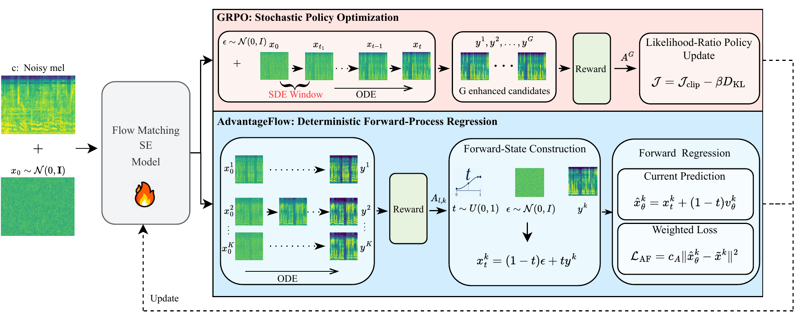

<div align="center">

# GA-AF-FlowSE

### Forward-Process Reinforcement Learning for Flow-Matching Speech Enhancement

[](https://huggingface.co/spzhang7/GA-AF-FlowSE)

[Getting Started](docs/GETTING_STARTED.md) · [Hugging Face](https://huggingface.co/spzhang7/GA-AF-FlowSE) · [Checkpoints](checkpoints/README.md) · [FlowSE Attribution](docs/FLOWSE_UPSTREAM.md)

</div>

**GA-AF** is a forward-process reinforcement learning framework for FlowSE-based speech enhancement. It performs reward-guided post-training through deterministic forward-process regression and coordinates multiple reward objectives according to their induced gradient alignment, while preserving FlowSE's deterministic ODE inference formulation.

This repository provides a unified implementation of **AdvantageFlow (AF)**, **Gradient-Aligned AdvantageFlow (GA-AF)**, and a controlled **FlowSE-GRPO** baseline used in the accompanying paper.

> **Paper:** *Forward-Process Reinforcement Learning for Flow-Matching Speech Enhancement*

---

## Method Overview

<p align="center">
  
</p>

The upper branch illustrates **GRPO**, which introduces stochasticity through an SDE window and performs likelihood-ratio policy optimization. The lower branch illustrates **AdvantageFlow**, which keeps the rollout deterministic and turns terminal reward feedback into a weighted forward-regression objective. **GA-AF** extends this forward-process formulation by computing reward-specific induced gradients and dynamically emphasizing auxiliary objectives whose directions align with the primary perceptual-quality objective.

---

## Highlights

- **Forward-process RL:** reward-guided post-training without differentiating through the reverse ODE rollout.
- **Gradient-aligned multi-reward optimization:** GA-AF combines reward-specific advantages according to induced gradient alignment rather than fixed reward weights.
- **Unified comparison:** AF, GA-AF, and a controlled FlowSE-GRPO implementation are provided under the same project.
- **Reproducible pipeline:** 5000-update training templates, dataset utilities, evaluation tools, and unit tests are included.

---

## Paper Results

The following DNSMOS OVRL results are reported on the DNS2020 evaluation setting used in the paper.

| Method | No Reverb OVRL ↑ | With Reverb OVRL ↑ |
|---|---:|---:|
| FlowSE Base | 3.353 | 3.225 |
| FlowSE Base + GRPO (controlled) | 3.412 | 3.385 |
| FlowSE Base + AF | 3.504 | 3.472 |
| **FlowSE Base + GA-AF** | **3.616** | **3.614** |

Under the matched **5000-update** comparison:

| Method | Post-training Time ↓ |
|---|---:|
| AF | 126.9 h |
| GA-AF | 139.6 h |
| GRPO (controlled) | 271.1 h |

GA-AF uses **48.5% less post-training time** than the controlled GRPO implementation in this matched setting.

> **Note:** GA-AF is quality-primary by design. The paper also reports the trade-off between DNSMOS improvement and speaker/content fidelity; please consider all reported metrics rather than OVRL alone.

---

## Quick Start

### Installation

Python **3.10+** is recommended.

```bash
python -m pip install -r requirements.txt
```

For CUDA 12.1, install the matching PyTorch wheels first if your platform does not select them automatically:

```bash
python -m pip install torch==2.2.0+cu121 torchaudio==2.2.0+cu121 \
  --index-url https://download.pytorch.org/whl/cu121
python -m pip install -r requirements.txt
```

Run the method-side tests with:

```bash
python -m pytest -q rl/af/tests rl/grpo/tests
```

For a complete fresh-checkout walkthrough, including model placement, data layout, and full training commands, see [`docs/GETTING_STARTED.md`](docs/GETTING_STARTED.md).

### Data and Pretrained Models

This repository does not redistribute speech datasets, evaluator weights, FlowSE checkpoints, Vocos weights, or training artifacts.

1. Download LibriTTS and the required noise/reverberation data according to
   their upstream licenses, then use
   [`tools/prepare_libritts_dns10s.py`](tools/prepare_libritts_dns10s.py) to
   construct the paired layout described in
   [`docs/GETTING_STARTED.md`](docs/GETTING_STARTED.md).
2. Download FlowSE and Vocos weights according to
   [`checkpoints/README.md`](checkpoints/README.md) and the upstream
   [FlowSE repository](https://github.com/honee-w/flowse).
3. Download DNSMOS, ERes2Net, and WavLM/SpeechBERTScore models as described in [`pretrainmodel/README.md`](pretrainmodel/README.md).
4. Edit data, model, and output paths in the corresponding YAML configuration.

### Training

Formal AF, GA-AF, and GRPO training runs:

```bash
# AdvantageFlow
python scripts/train_af.py \
  --config configs/af/af_libritts_dns10s_5000step.yaml

# GA-AF
python scripts/train_af.py \
  --config configs/af/gaaf_libritts_dns10s_0_to_5000.yaml

# Controlled GRPO
python scripts/train_grpo.py \
  --config configs/grpo/grpo_libritts_dns10s_4gpu_5000update.yaml
```

### Evaluation

Use the tools under [`tools/`](tools/) for paired enhancement metrics and DNSMOS summaries. FlowSE inference uses the pinned baseline entry point:

```bash
python flowse/infer.py -conf <your-flowse-config.yaml>
```

The paper configuration uses deterministic FlowSE Euler sampling at **NFE = 32** for evaluation.

---

## Pretrained Checkpoints

Project checkpoints are published in the Hugging Face repository
[`spzhang7/GA-AF-FlowSE`](https://huggingface.co/spzhang7/GA-AF-FlowSE). The
repository contains the following public assets:

```text
spzhang7/GA-AF-FlowSE
├── base_sft20k/flowse_sft20k.pt
├── af/af_libritts_step005000.pt
├── gaaf/gaaf_libritts_step005000.pt
└── grpo/grpo_libritts_step005000.pt
```

The original FlowSE baseline and Vocos weights are downloaded separately as
described in [`checkpoints/README.md`](checkpoints/README.md).

---

## Repository Structure

```text
GA-AF-FlowSE/
├── flowse/                 # Third-party FlowSE baseline
├── rl/
│   ├── af/                 # Ordinary AdvantageFlow
│   ├── gaaf/               # GA-AF gradient-alignment extension
│   ├── grpo/               # Controlled GRPO comparison
│   ├── common/             # Shared data, FlowSE, LoRA, and protocol modules
│   └── rewards/            # Composite rewards and calibration utilities
├── configs/                # FlowSE, AF, GA-AF, and GRPO templates
├── scripts/                # Training and FlowSE maintenance entry points
├── tools/                  # Dataset preparation and evaluation tools
├── pretrainmodel/          # Pretrained evaluator download instructions
├── checkpoints/            # Checkpoint placement and release instructions
└── docs/                   # Reproduction, upstream, and compatibility notes
```

---

## Reproduction Details

The public composite reward uses DNSMOS OVRL, ERes2Net speaker similarity, and SpeechBERTScore content fidelity. To keep the main README readable, the calibration details are collapsed below.

<details>
<summary><b>Reward calibration used by the public DNS10s configuration</b></summary>

```text
DNSMOS OVRL:       0.6 * (DNSMOS_OVRL / 4) / 0.07032371343108539
ERes2Net speaker:      1.0 * ERes2Net / 0.13865593039460408
SpeechBERTScore:       1.0 * SpeechBERTScore / 0.09550272361009968

source_nfe=10, std_ddof=0, dnsmos_divisor=4.0
```

</details>

---

## Built Upon & Attribution

This project builds on **FlowSE / FlowMSE** as the speech-enhancement backbone. The upstream repository, pinned commit, local compatibility patch, and citation are documented in [`THIRD_PARTY_NOTICES.md`](THIRD_PARTY_NOTICES.md) and [`docs/FLOWSE_UPSTREAM.md`](docs/FLOWSE_UPSTREAM.md).

The self-authored AF / GA-AF / GRPO adapter and utility code is covered by the root [`LICENSE`](LICENSE). Third-party code, evaluator models, Vocos, datasets, and checkpoints remain subject to their respective licenses and terms.

---

## Citation

If you use this repository, please cite the paper and the FlowSE baseline. Repository metadata is also available in [`CITATION.cff`](CITATION.cff).

```bibtex
@misc{zhang2026forwardprocess,
  title  = {Forward-Process Reinforcement Learning for Flow-Matching Speech Enhancement},
  author = {Shuaipeng Zhang and Hang Chen and Jun Du and Qing Wang and
            Sabato Marco Siniscalchi and Zihao Quan and Zijing Cai and Boyuan Dong},
  year   = {2026},
  note   = {GA-AF-FlowSE},
  url    = {https://github.com/spzhang7/GA-AF-FlowSE}
}
```

For FlowSE, please also use the citation in [`THIRD_PARTY_NOTICES.md`](THIRD_PARTY_NOTICES.md).
